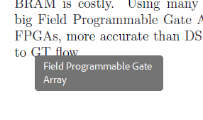
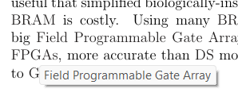
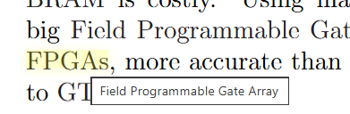
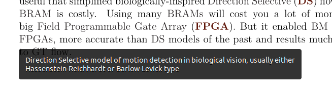
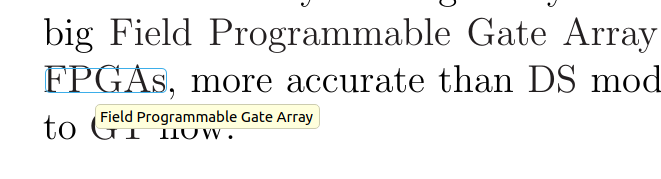
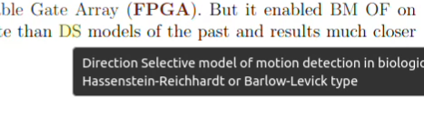
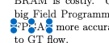
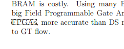

# acronyms-with-tooltips-latex

Adds tooltip popups for LaTeX PDF projects so readers have an easier time understanding your acronyms.

See the example Overleaf project: https://www.overleaf.com/read/fyvbnxpwwjss#6de35b


## How it works

Uses the [glossaries](https://ctan.org/pkg/glossaries) package and [pdfcomment](https://ctan.org/pkg/pdfcomment), with a patch that emits **both** annotation types on each tooltip:

- `/Subtype /Square` with `/Contents` (SumatraPDF/muPDF-friendly)
- Original `/Subtype /Widget` `/Btn` with `/TU` (Acrobat-friendly)

They share the same rectangle and overlap; viewers pick what they support.

## Overleaf upload checklist

Upload these files to your Overleaf project (no shell escape needed):

| File | Purpose |
|------|---------|
| `acronymtooltips.sty` | Main package (`\xx`, `\xxx`, glossaries setup) |
| `acronymtooltips-pdfcomment.tex` | pdfcomment patch (loaded by the `.sty`) |
| `myacronyms.tex` | Your `\newacronym{...}` definitions only |

Optional for a standalone example: upload `main.tex` as your project root.

Dependencies (`glossaries`, `pdfcomment`, `xcolor`) are already on Overleaf.

## Standalone example

Use `main.tex` in this repo as a template:

```latex
\documentclass[12pt]{article}
\usepackage{acronymtooltips}
\input{myacronyms}

\begin{document}
Testing \xx{of} algorithms is hard because \xx{of} requires good \xx{gt} data.
\end{document}
```

Compile with pdfLaTeX (twice if references change).

## Integrate into an existing Overleaf paper

Copy the contents of `integration-snippet.tex` into your preamble (after `\documentclass`, before `\begin{document}`):

```latex
\usepackage{acronymtooltips}
\input{myacronyms}
```

Replace `\gls{key}` or manual acronyms with `\xx{key}` (singular) and `\xxx{key}` (plural). First use expands the full definition with bold/colored short form; later uses show the short form with a PDF tooltip on hover.

Customize colors in `acronymtooltips.sty` or redefine `\accolor` and `\acfirstformat` after `\usepackage{acronymtooltips}`.

## Commands

| Command | Meaning |
|---------|---------|
| `\xx{key}` | Singular acronym; tooltip on subsequent uses |
| `\xxx{key}` | Plural acronym; tooltip on subsequent uses |
| `\newacronym{key}{SHORT}{Long form}` | Define in `myacronyms.tex` |
| `\newacronym[description={...}]{key}{SHORT}{Long}` | Optional longer tooltip text |

## PDF viewer compatibility

Tested with `main.pdf` in this repo. Dual annotations emit both `/Square` `/Contents` and `/Btn` `/TU` on the same rectangle.

| Viewer | Hover tooltip | Notes |
|--------|---------------|-------|
| Adobe Acrobat / Reader | Yes | Reference behavior |
| SumatraPDF 3.7+ (muPDF) | Yes | Square patch required (default pdfcomment `/Btn` alone fails) |
| Overleaf built-in preview (PDF.js) | Yes | Yellow highlight + popup |
| Evince (Linux) | Yes | Hover popup |
| Okular (Linux) | Yes | Enable **Show annotations** and **Show forms** (Settings → PDF) |
| macOS Preview / Mac PDF viewer | No | Click shows form-field handles only; no tooltip text |
| Google Chrome PDF viewer (PDF.js) | No | Click shows dotted form-field outline only; no tooltip |
| Firefox PDF viewer (PDF.js) | Yes | Tested Firefox 151.0.3 on Ubuntu 22; dark hover popup |
| Cursor / VS Code PDF preview (PDF.js) | Partial | May show yellow split popup; inconsistent |

The PDF spec does not strictly define tooltip behavior; viewers differ. `/Btn` `/TU` widgets work like native tooltips in Acrobat; Poppler-based viewers (Evince, Okular) respond to `/Square` `/Contents`. Firefox’s PDF.js build shows hover tooltips in our tests; Chrome’s PDF.js and macOS Preview treat the `/Btn` layer as a form field (click-to-select) without hover tooltip text.

### Viewer screenshots

Thumbnail captures from the same `main.pdf` (hover over `\xxx{fpga}` or similar unless noted):

<table>
<tr>
<td align="center"><br/><b>Acrobat</b><br/>✓ hover</td>
<td align="center"><br/><b>SumatraPDF 3.7</b><br/>✓ hover</td>
<td align="center"><br/><b>Overleaf</b><br/>✓ hover</td>
<td align="center"><br/><b>Evince</b><br/>✓ hover</td>
</tr>
<tr>
<td align="center"><br/><b>Okular</b><br/>✓ hover<br/><small>annotations + forms on</small></td>
<td align="center"><br/><b>Firefox 151</b><br/>✓ hover</td>
<td align="center"><br/><b>macOS Preview</b><br/>✗ click only</td>
<td align="center"><br/><b>Chrome (PDF.js)</b><br/>✗ click only</td>
</tr>
</table>

### Chrome and macOS Preview: why no hover tooltip?

Chrome and macOS Preview pick up the invisible `/Btn` form field and show **selection chrome on click** (dotted outline in Chrome, blue handles on Mac). Neither displays `/TU` or `/Square` `/Contents` as a hover tooltip in our tests. Firefox (also PDF.js-based) does show hover tooltips on Ubuntu 22.

Possible directions (not implemented yet):

1. **Square-only mode** — omit the `/Btn` widget layer so PDF.js at least stops showing form-field UI on click (tooltips would still be missing in Chrome; desktop viewers that need Square keep working).
2. **`/Text` + `/Popup` child annotations** — closer to PDF “comment popup” spec; worth testing in Evince/Okular/PDF.js if someone wants to experiment.
3. **Tell readers** — for browser viewing, Firefox works; Chrome does not. First-use expansion (`\xx` prints the long form once) always helps; for hover on repeated acronyms recommend Evince, Okular, Firefox, Overleaf preview, Acrobat, or SumatraPDF.
4. **Track PDF.js** — [Mozilla bug 1661419](https://bugzilla.mozilla.org/show_bug.cgi?id=1661419) and pdf.js annotation issues; browser support may improve over time.

On Linux, Evince, Okular, and Firefox work well. Overleaf preview works. Chrome and macOS Preview do not.

## Updating an Overleaf project

Upload the files from [Overleaf upload checklist](#overleaf-upload-checklist) via the Overleaf web UI, or copy them into your project folder if you use Dropbox (or another sync) with Overleaf. Recompile in Overleaf, then test the PDF preview.

## Legacy files

| File | Status |
|------|--------|
| `acronyms.tex` | Thin wrapper: `\usepackage{acronymtooltips}` + `\input{myacronyms}` — for `\include{acronyms}` |
| `pdfcomment-patched.tex` | Redirects to `acronymtooltips-pdfcomment.tex` |

Prefer `\usepackage{acronymtooltips}` and `\input{myacronyms}` in new projects.

## Local build

```bash
pdflatex main.tex
pdflatex main.tex
```

Open `main.pdf` in Evince, Okular (**Show annotations** + **Show forms**), Firefox, Overleaf preview, or Acrobat and hover over repeated acronyms (e.g. the second `\xx{of}`) to see tooltips.
